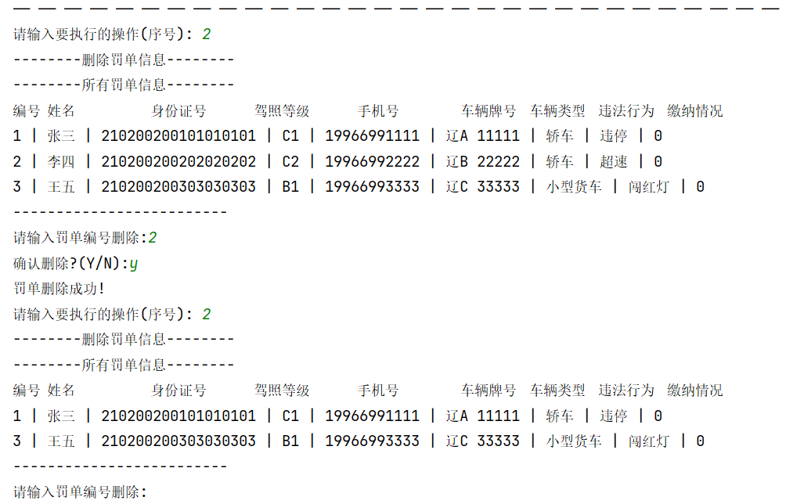
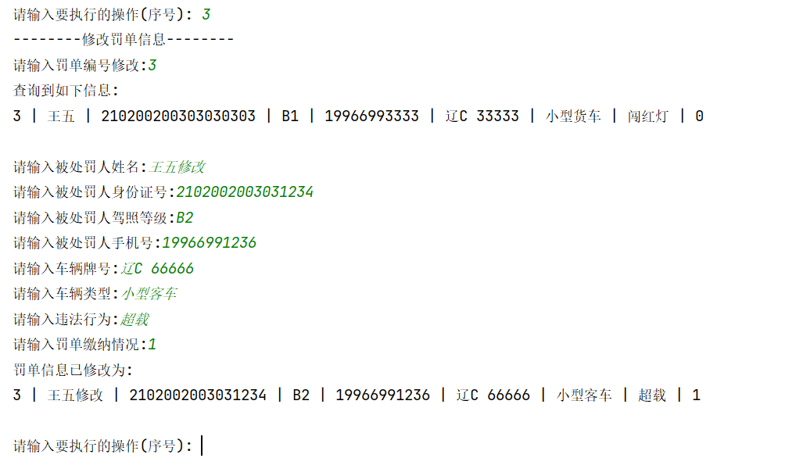
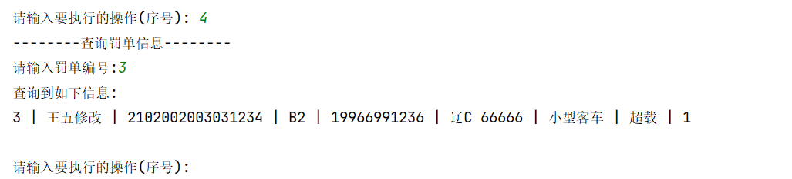
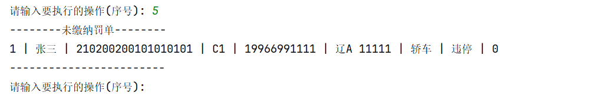
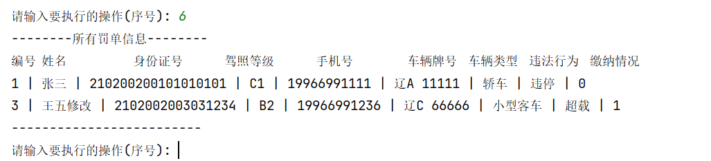

# 控制台打印实现的本地交通罚单管理系统(学生作业)
### VX：huanchou33  |  python各种代码代做
价格便宜，啥都会做，直接发题目需求。辅助python报告/期末/实验/大作业/毕业设计。
能够帮助您处理包括但不限于以下领域的问题：
Python**数据处理**、**大模型**相关(langchain/RAG增强索引)、**大数据**相关环境部署(Hadoop/Hive/Mapreduce/Hbase/Zookeeper)
图表制作(Matplotlib/Pyecharts)、数据**可视化**、**数据分析**等。同时提供**机器学习**和深度学习的编程辅导，涵盖模型建立和调优
例如线性回归、逻辑回归、决策树、支持向量机(SVM)、随机森林、KNN K近邻、PCA 主成分分析

### 效果如图
**录入罚单**
  
**删除罚单**
  
**修改罚单**
  
**查询罚单**
  
**查看未缴纳罚单**
  
**查看所有罚单**

